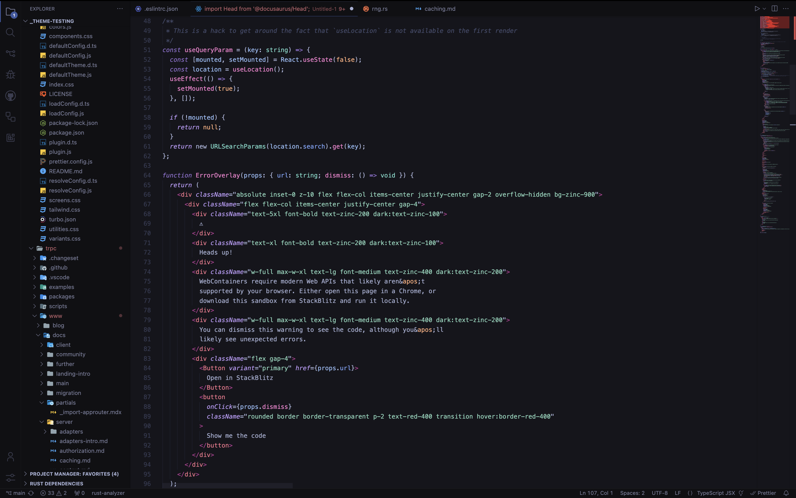
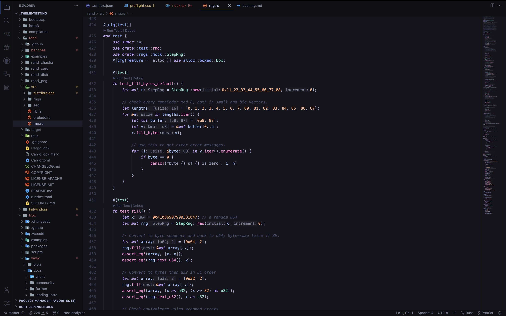
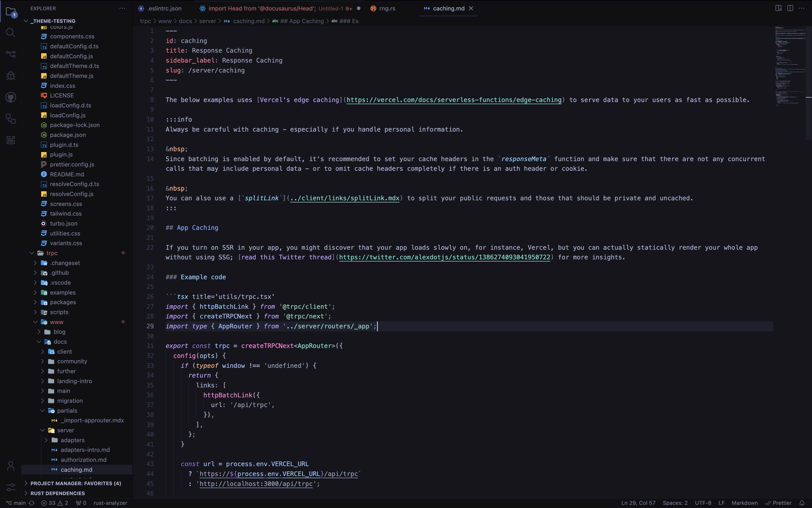

# ☄️ Meteora

**Meteora** is a refined Visual Studio Code theme for those who love elegant code editing that is easy on the eyes.

## Theme

### TypeScript React

### CSS

### Rust

### Markdown

## Installation

1. Install [Visual Studio Code](https://code.visualstudio.com/)
2. Launch Visual Studio Code
3. Choose **Extensions** from menu
4. Search for `meteora`
5. Click **Install** to install the theme
6. From the menu bar click: Code > Preferences > Color Theme > **Meteora**

## 🚧 Disclaimer

Meteora is very much in alpha development, and is expected to be unpolished for most programming languages at this time. Please look at the [supported languages](#📘-language-support) for more information.

> Have any suggestions or feedback on how to make Meteora _even better_? Please consider [contributing](#❤️-contributing)!

## 📘 Language Support

The following languages have been tested and are confirmed to have compatibility with Meteora.

- Bash
- CSS
- HTML
- JavaScript
- JSON
- Markdown
- React
- Rust
- Shell
- TOML
- TypeScript
- XML
- YAML

### Upcoming Support

Please keep an eye out on these languages and frameworks having full support in the future as well!

- C
- C++
- C#
- Dart
- Go
- Java
- PHP
- Python
- Ruby
- SCSS
- SQL
- Svelte
- Swift
- Terraform
- Vue

## 🎨 Color Palette

| Color                                                               | Usage                                   |
| ------------------------------------------------------------------- | --------------------------------------- |
|  `#F7768E` | Tags (HTML, XML, etc.)                  |
|  `#F981D1` | Methods                                 |
|  `#FFAC7C` | Numbers, Booleans, Pointers, References |
|  `#73DACA` | Entities, Types                         |
|  `#906FCE` | Storage                                 |
|  `#BB9AF7` | Keywords                                |
|  `#7AA2F7` | Properties                              |
|  `#97BEF9` | Variables, Parameters                   |
|  `#C0CAF5` | Operators                               |
|  `#A9B1D6` | Plain Text, Punctuation                 |
|  `#929BBA` | Strings                                 |
|  `#444B6A` | Comments                                |
|  `#15151B` | Editor Background                       |
|  `#101013` | Sidebar, Terminal Background            |

## ❤️ Contributing

Have any suggestions or feedback on how to make Meteora _even better_? Please consider contributing by [opening an issue](https://github.com/pjmiravalle/meteora-vscode-theme/issues) or [creating a pull request](https://github.com/pjmiravalle/meteora-vscode-theme/pulls)!

## 🙌 Credits

Inspired by the [Tokyo Night](https://github.com/enkia/tokyo-night-vscode-theme) theme, Meteora brings even further refinement and improvements to your coding experience.
